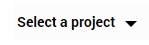
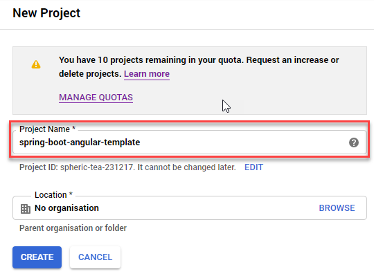
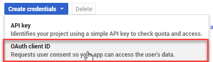
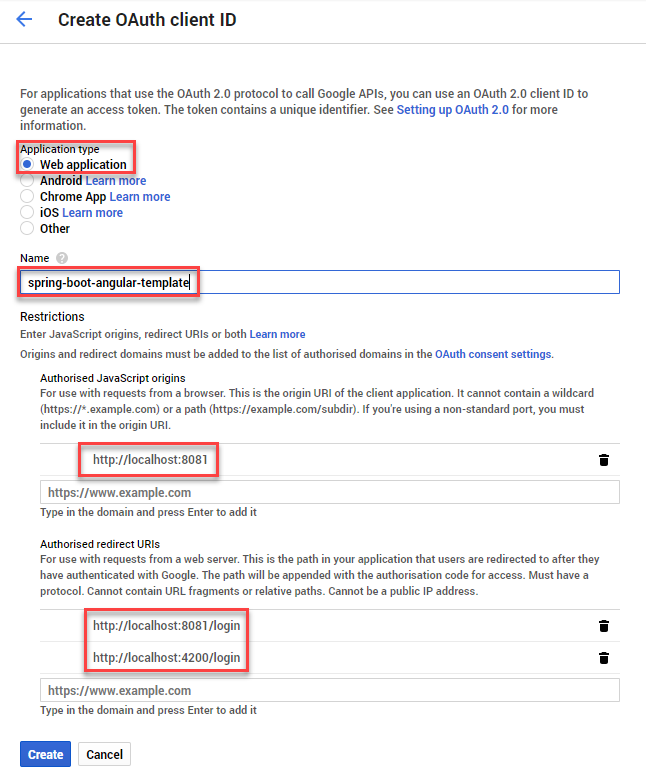
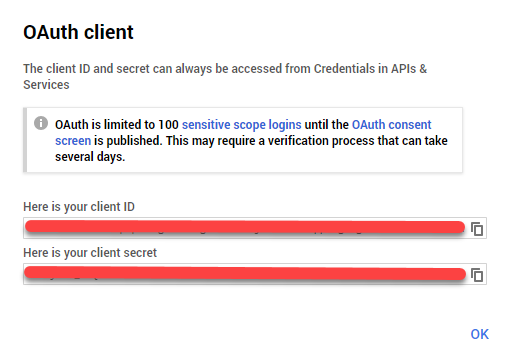

Spring-Boot-Angular-Template
----------------------------
Template for a new Web-Application with OAuth 2.0 User Authentication and Docker. Spring-Boot 2 with
Java 11 as Backend and Angular 7 with Bootstrap 4 as Frontend. A User with a Google-Account
(no additional registration required) get access to the Web-Application and get at first the
Default-Role ROLE_USER. The Role-Management is implemented in the Web-Application.

Technology-Stack:
-----------------
* :leaves: Spring-Boot 2 (Spring AOP, Spring Web, Spring Data JPA, Spring Security)
* :a: Angular 7 (Bootstrap 4, TypeScript, HTML, CSS)
* :whale: [Docker](https://www.docker.com/get-started)**
* :lock: OAuth 2.0 Authentication
* :coffee: [JDK 11](https://www.oracle.com/technetwork/java/javase/downloads/jdk11-downloads-5066655.html)**
* [Maven](https://maven.apache.org/download.cgi)**
* [Lombok](https://projectlombok.org/download)**
* :droplet: Liquibase
* MariaDB
* JUnit 5
* DBUnit 1.3 with HSQLDB
* Logback (logback-spring.xml)
* [Git](https://git-scm.com/downloads)**

** Need to be installed on the Operating System

Modules
-------
* backend - Spring-Boot 2
* frontend - Angular 7
* dbsetup - Liquibase Database-Setup with MariaDB as Database for the backend

Installation-Instructions
-------------------------
**Step 1:** Open a Terminal and type:
```bash
$ git clone https://github.com/mrrobworks/spring-boot-angular-template.git
$ cd spring-boot-angular-template
```

**Step 2:** Install the application with:
```bash
$ mvn clean install
```

**Step 3:** Open a webbrowser and go to [https://console.developers.google.com](https://console.developers.google.com)

**Step 4:**  in the upper navigation-bar.

**Step 5:** Create a  and type in following:



**Step 6:** Go to the left sidemenu an select 

**Step 7:** Select



**Step 8:** Type in following:



**Step 9:** Copy your generated `client ID` and `client secret`



and paste it in `./backend/src/main/resources/application.properties`

```
security.oauth2.client.client-id=<CLIENT-ID>
security.oauth2.client.client-secret=<CLIENT-SECRET>
```

**Step 10:** Back to the Terminal type following:
```bash
$ cd backend
$ docker-compose up
```

**Step 11:** In your Webbrowser type `http://localhost:8081` and the webapplication shows up.

Authentication-Concept:
-----------------------
* User authenticate through username + password from a custom Google
Account and grant standard access to the backend-application with a
standard-role (ROLE_USER).

* If access is granted by Google, than the Google-User-Id (sub,
principalid) get stored into the backend-db with a
JPA-AppUser-Object

* AppUser-Object get Roles from the backend-db and can be added
there.

TODOs
-----
- [ ] Microservices from this Projekt for creating github-repositories
- [x] User-Roles Access on custom sites / elements
- [x] Angular / CSS / Bootstrap (Angular-Material Implemented)
- [ ] Profile in OAuthSecurityConfiguration (Google, Github)
- [x] User-Role-assignment through webapplication
- [x] Save LoggedIn User to Session
- [ ] CRUD Roles for Administrator of the Application
- [x] Building Docker-Image with Spring-Boot and Angular
- [ ] Comment Function for Blog-Entries (after successful login with userid)
- [ ] Create schema.sql and data.sql for script based data initialization
(spring.jpa.hibernate.ddl-auto=none / spring.datasource.initialize=true)
- [ ] Create ViewModel-Beans for each JPA-Model-Entity-Bean